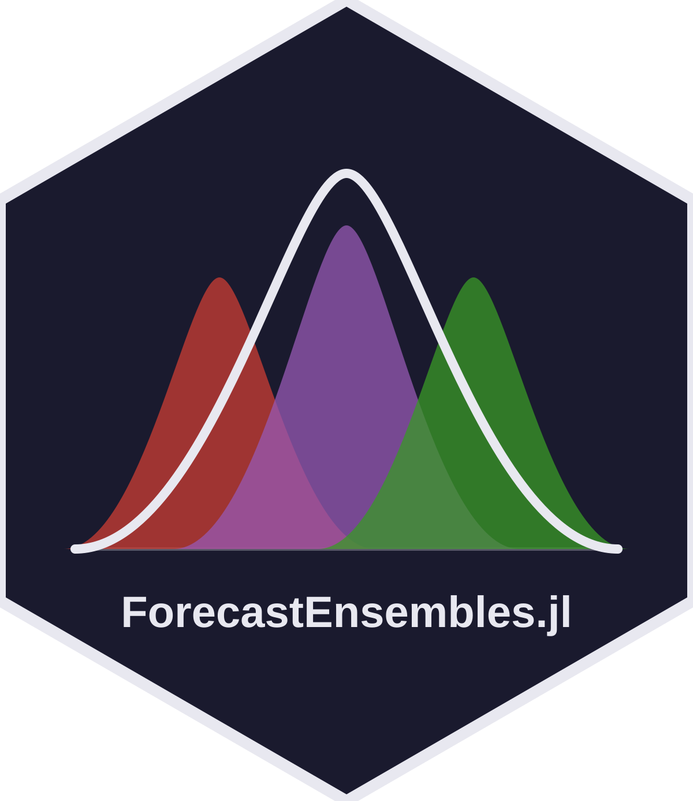

# ForecastEnsembles.jl 

<!-- badges:start -->
| **Documentation** | **Build Status** | **Code Quality** | **License & DOI** | **Downloads** |
|:-----------------:|:----------------:|:----------------:|:-----------------:|:-------------:|
| [](https://sbfnk.github.io/ForecastEnsembles.jl/stable/) [](https://sbfnk.github.io/ForecastEnsembles.jl/dev/) | [](https://github.com/sbfnk/ForecastEnsembles.jl/actions/workflows/test.yaml) [](https://codecov.io/gh/sbfnk/ForecastEnsembles.jl) | [](https://github.com/SciML/SciMLStyle) [](https://github.com/JuliaTesting/Aqua.jl) [](https://github.com/aviatesk/JET.jl) | [](https://opensource.org/licenses/MIT) | [](https://juliapkgstats.com/pkg/ForecastEnsembles) [](https://juliapkgstats.com/pkg/ForecastEnsembles) |
<!-- badges:end -->

[](https://lifecycle.r-lib.org/articles/stages.html#experimental)

> **Experimental.** The API is still moving and the underlying forecast
> data types are under active redesign. Pin a specific commit if you
> depend on it.

## Overview

A Julia package for combining probabilistic forecasts from several component
models.

`ForecastEnsembles.jl` computes weighted or unweighted ensembles of forecasts
expressed as quantiles, samples, CDFs, or summary statistics. Weights can be
supplied by the user, fixed (equal weighting), or estimated from past
forecast performance via quantile regression averaging or CRPS-stacking.
Trained and untrained methods are interchangeable through one `EnsembleWeights`
type.

The work builds on three R packages:
[`hubEnsembles`](https://github.com/Infectious-Disease-Modeling-Hubs/hubEnsembles)
(simple/weighted mean and median, linear opinion pool),
[`qrensemble`](https://github.com/epiforecasts/qrensemble) (quantile regression
averaging), and
[`lopensemble`](https://github.com/epiforecasts/lopensemble) (CRPS-stacked
linear opinion pool). The Julia version pulls all three under one in-memory
representation, two verbs (`fit`, `combine`), and two ensemble types
(`MixtureEnsemble`, `QuantileEnsemble`). Multiple dispatch picks the right
algorithm for each `(output_type, method)` pair.

The optimiser backends are pluggable: QRA's LP runs through JuMP, so
HiGHS, GLPK, Gurobi or anything else with a JuMP wrapper is one line
away, and CRPS-stacking goes through Optim.jl.

## Getting started

```julia
using ForecastEnsembles, DataFrames

df = DataFrame(
    location       = "A",
    horizon        = 1,
    model_id       = repeat(["m1", "m2", "m3"], inner = 2),
    output_type    = "quantile",
    output_type_id = repeat([0.25, 0.75], 3),
    value          = [1.0, 3.0, 2.0, 4.0, 0.5, 2.5],
)

ft = ForecastTable(df; task_id_cols = [:location, :horizon])
combine(ft, QuantileEnsemble(:mean))
```

For an end-to-end walkthrough on real flu hospitalisation forecasts, see
`docs/src/example.md`.

## Documentation

Full documentation — method reference, worked examples, and the API — is at
[sbfnk.github.io/ForecastEnsembles.jl](https://sbfnk.github.io/ForecastEnsembles.jl/stable/).
The [`docs/src/methods.md`](docs/src/methods.md) page explains the two axes
(combination operation and weighting scheme) that organise the methods.

<!-- standard-sections:start -->
<!-- MANAGED by EpiAwarePackageTools.scaffold — do not edit between the
     markers. These standard sections are re-rendered on every scaffold_update;
     edit the package-owned sections outside them, or CITATION.cff. -->

## Contributing

We welcome contributions and new contributors! Please open an issue or pull request on [GitHub](https://github.com/sbfnk/ForecastEnsembles.jl). This package follows [ColPrac](https://github.com/SciML/ColPrac) and the [SciML style](https://github.com/SciML/SciMLStyle).

## How to cite

If you use ForecastEnsembles in your work, please cite it. Citation metadata lives in [`CITATION.cff`](https://github.com/sbfnk/ForecastEnsembles.jl/blob/main/CITATION.cff), which GitHub renders as a "Cite this repository" button on the repository page.

## Code of conduct

Please note that the ForecastEnsembles project is released with a [Contributor Code of Conduct](https://github.com/EpiAware/.github/blob/main/CODE_OF_CONDUCT.md). By contributing, you agree to abide by its terms.
<!-- standard-sections:end -->
